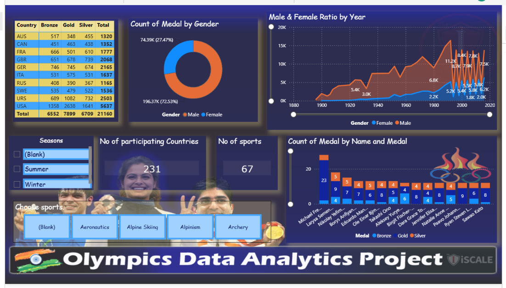

# 🏅 Olympics Data Analysis Dashboard

## 📌 Project Overview

This project presents an interactive Power BI dashboard built using Olympics historical data. The dashboard provides insights into athlete participation, medal distribution, country performance, gender-wise analysis, and sports trends across Olympic Games.

## 📊 Dashboard Preview

## 🚀 Features

* Country-wise medal analysis
* Gender participation insights
* Top performing athletes
* Sports-wise performance tracking
* Interactive slicers and filters
* KPI cards for quick insights
* Dynamic visualizations using Power BI

## 📈 Key Metrics

* Participating Countries: 231
* Sports Categories: 67
* Total Medals: 21,160

## 🛠️ Tools & Technologies

* Power BI
* Power Query
* DAX
* Microsoft Excel

## 📂 Repository Contents

* `olympic data analysis.pbix` – Power BI Dashboard File
* `Olympics Dataset.xlsx` – Source Dataset
* `pbi_dashboard.png` – Dashboard Screenshot
* `BG Theme.png` – Dashboard Background Theme

## 🎯 Objectives

* Analyze Olympic Games data effectively
* Identify top-performing countries and athletes
* Explore gender participation trends
* Visualize medal distribution patterns

## 👨‍💻 Author

**Karan Kumar Chauhan**

Aspiring Data Analyst | Power BI | SQL | Excel | Data Visualization

